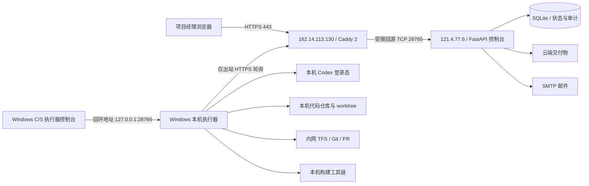
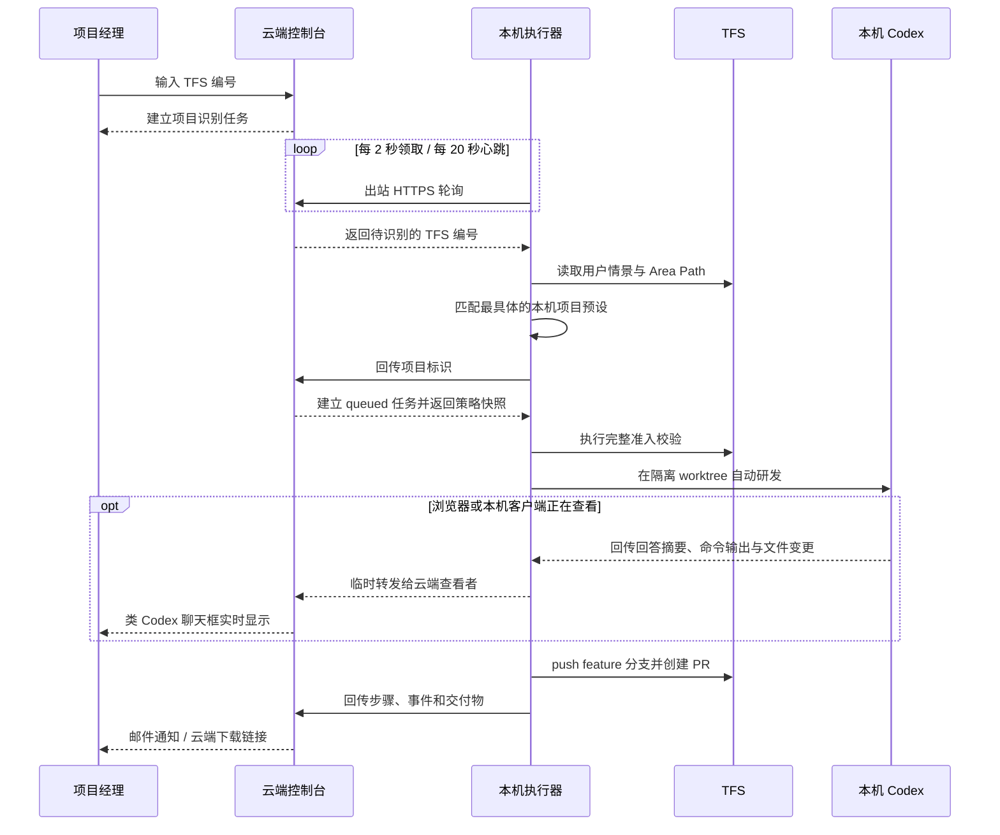

# 混合部署架构

## 系统边界

云端是控制面，本机是执行面。云端不安装 Codex、不挂载代码仓库，也不保存 TFS/Codex 凭据；本机无需接受任何来自公网的连接。

## 任务序列

## 三种交付分支

| 交付方式 | 本机执行器动作 | 合并前通知 | 完成条件 | 最终交付 |
|---|---|---|---|---|
| 本机打包 | push feature 分支、执行构建、上传包/SQL/配置 | 无 | 构建和上传完成 | 云端发送交付邮件 |
| 四川审核后交付 | 构建门禁、创建 PR、专用服务账号批准 | 无 | 轮询检测 PR completed | 上传合并截图/凭证并发送邮件 |
| 产品审核后交付 | 创建 PR | 云端邮件把 PR 发给项目经理 | 产品部人工合并，执行器循环检测 | 上传合并截图/凭证并发送邮件 |

PR 创建时关联 TFS 工作项，目标固定为项目策略中的 `dev`（或显式基础分支），配置 auto-complete 和合并后删除源分支。自动批准只允许使用经授权的专用审核账号。

## 状态与恢复

`queued → validating → developing → submitting/building → waiting_merge → capturing → delivering → delivered`

- 项目匹配成功时完整快照项目策略，后续修改不会改变进行中的任务。
- 本机 `project-presets` 是项目策略唯一配置源；执行器检测到目录变化后同步云端只读目录，删除的本机预设会在云端停用。
- `queued` 和 `waiting_merge` 存在云端数据库，本机重启后可以继续领取或轮询。
- 本机每 20 秒报告心跳；90 秒未上报时控制台显示离线。
- Codex 详细输出只进入进程内存：第一个查看者打开后才开始采集，最后一个查看者关闭或超时后立即清空；数据库只保存精简状态事件。
- 本机 C/S 控制台通过仅监听回环地址的监控接口查看任务与实时会话，并通过现有 PowerShell 管理脚本启动、停止或重启执行器。
- 任务执行中仍会检查云端取消状态。
- 自动开发中断后不自动从头重放，避免重复 commit、push 或 PR；保留事件、分支和错误供管理员确认。

## 凭据与网络

| 凭据 | 保存位置 | 用途 |
|---|---|---|
| 云端管理员密码 | 云服务器 Docker secret | 首次管理员登录 |
| 会话密钥 | 云服务器 Docker secret | 登录 Cookie 签名 |
| Runner token | 云端与本机各一份 | 本机调用 runner API |
| SMTP 密码 | 后端 `.env.backend`（按当前部署要求） | 云端发送邮件 |
| TFS PAT | 仅 Windows 本机 | 需求、Git 与 PR |
| 四川审核 PAT | 仅 Windows 本机 | 专用账号批准 PR |
| Codex 登录/API key | 仅 Windows 本机 | 本机自动研发 |

Runner token 只经 TLS 发送；云端 Runner API 不使用浏览器 Cookie。构建子进程使用清理后的环境变量，TFS PAT 通过临时 Git 认证配置注入，不写入仓库 remote URL。
